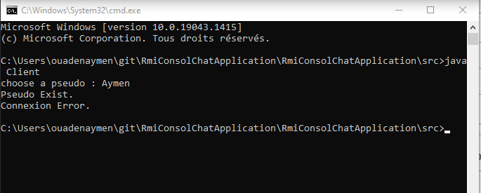

# Rmi-Consol-Chat-Application

This is a simple chat application, using RMI(Remote method invocation).
It contains some base features:
  - Connect to the chat room with pseudo (Can't have two users with the same pseudo).
  - Send and receive messages.
  - Left the room.
To run the application, move Inside the src folder and do :
  - Lance the first CMD and write: rmiregistry
  - Lance the second CMD and write: java Server
  - Lance another CMD for each user and write: java Client

